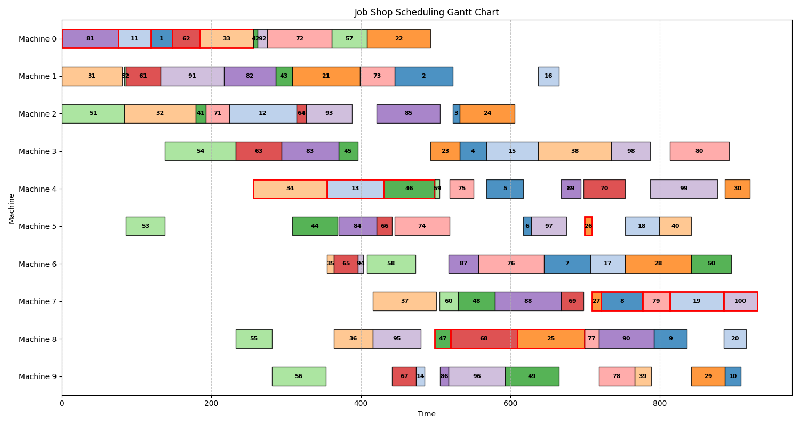

# Tabu Search for Job Shop Scheduling Problem (JSSP)

An efficient C++ implementation of Tabu Search for the Job Shop Scheduling Problem (JSSP) with Python bindings via pybind11.

## Table of Contents

- [Problem Description](#problem-description)
- [Features](#features)
- [Installation](#installation)
- [Usage](#usage)
    - [Python API](#python-api)
    - [C++ API](#c-api)
- [Benchmark Results](#benchmark-results)
- [Visualization](#visualization)
- [Reference](#reference)

## Problem Description

The **Job Shop Scheduling Problem (JSSP)** is a classic NP-hard combinatorial optimization problem where:

- Each job consists of an ordered sequence of tasks
- Each task requires a specific machine for a fixed duration
- Machines can only process one task at a time
- The objective is to minimize the total completion time (makespan)

## Features

- High-performance C++ core with Python bindings
- Tabu Search implementation with configurable parameters
- Support for standard benchmark instances (FT, LA, ABZ series)
- Result export to CSV
- Gantt chart visualization

## Installation

### Prerequisites

- Python 3.6+
- CMake ≥ 3.12
- C++ compiler (GCC/Clang/MSVC)
- pybind11

### Install Python Package

```bash
pip install .
```

For development mode:

```bash
pip install -e .
```

## Usage

### Python API

```python
import time
import jsp

# Load problem instance
instance = jsp.load_instance("../instance/ft/ft10.txt")

# Initialize Tabu Search solver
solver = jsp.TabuSearch(instance)

# Configure search parameters
time_limit = 20  # seconds
max_iterations = 10**8
target_makespan = 930  # Known optimal for FT10

# Define stopping condition
def should_stop():
    return time.time() >= start_time + time_limit or solver.makespan() == target_makespan

# Set random seed for reproducibility
jsp.set_seed(200111)

# Execute the search
start_time = time.time()
solver.search(max_iterations=max_iterations, stop_condition=should_stop)

# Output results
print(f"Best makespan found: {solver.makespan()}")
print(f"Total iterations: {solver.get_iter()}")
print(f"Execution time: {time.time() - start_time:.2f} seconds")
```

Example scripts are available in `examples/` directory.

### C++ API

```cpp
#include "tabu_search.h"

int main() {
    auto instance = load_instance("instances/ft10.txt");
    TabuSearch solver(instance);
    
    solver.search(100000000, [&]() {
        return solver.makespan() == 930;
    });
    
    solver.export_result("results.csv");
    return 0;
}
```

Build C++ version:

```bash
cmake -S . -B build -DCMAKE_BUILD_TYPE=Release
cmake --build build
```

## Benchmark Results

Test environment: 13th Gen Intel(R) Core(TM) i5-13490F @ 2.50 GHz

| Instance | n×m   | Best | Avg    | Worst | Avg. Iterations |
| -------- | ----- | ---- | ------ | ----- | --------------- |
| ft10     | 10×10 | 930  | 930.0  | 930   | 2317871.4       |
| la19     | 10×10 | 842  | 842.0  | 842   | 147897.4        |
| la21     | 15×10 | 1046 | 1046.0 | 1046  | 701835.2        |
| la24     | 15×10 | 935  | 935.0  | 935   | 1528499.4       |
| la25     | 20×10 | 977  | 977.0  | 977   | 911077.2        |
| la27     | 20×10 | 1235 | 1235.0 | 1235  | 209377.8        |
| la29     | 20×10 | 1157 | 1158.0 | 1160  | 31159394.6      |
| la36     | 15×15 | 1268 | 1268.0 | 1268  | 1726843.2       |
| la37     | 15×15 | 1397 | 1399.2 | 1403  | 33006278.8      |
| la38     | 15×15 | 1196 | 1198.4 | 1201  | 26639615.2      |
| la39     | 15×15 | 1233 | 1233.0 | 1233  | 6389358.2       |
| la40     | 15×15 | 1222 | 1223.6 | 1224  | 28899708.6      |
| abz7     | 20×15 | 658  | 659.6  | 660   | 25687161        |
| abz8     | 20×15 | 669  | 669.0  | 669   | 22552921        |
| abz9     | 20×15 | 679  | 681.2  | 684   | 21216061        |

## Visualization

Generate Gantt charts from results:

```bash
python output/draw.py results.csv
```



## Reference

Zhang, C., Li, P., Guan, Z., & Rao, Y. (2007). A tabu search algorithm with a new neighborhood structure for the jobshop scheduling problem. *Computers & Operations Research*, 34(11), 3229-3242. https://doi.org/10.1016/j.cor.2005.12.002
